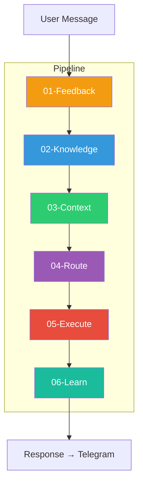
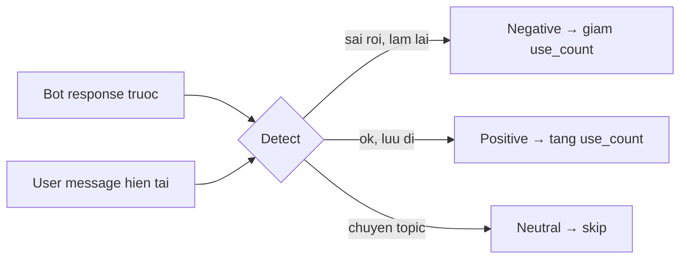
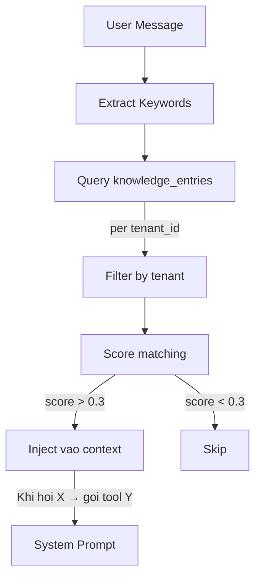
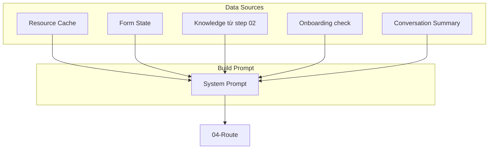
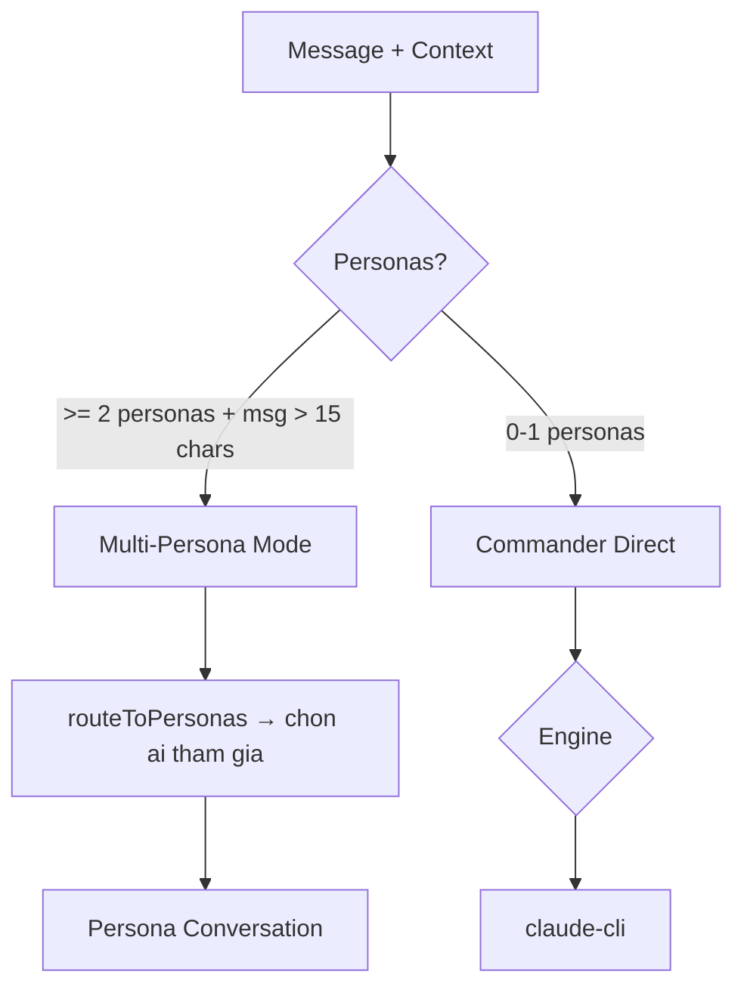
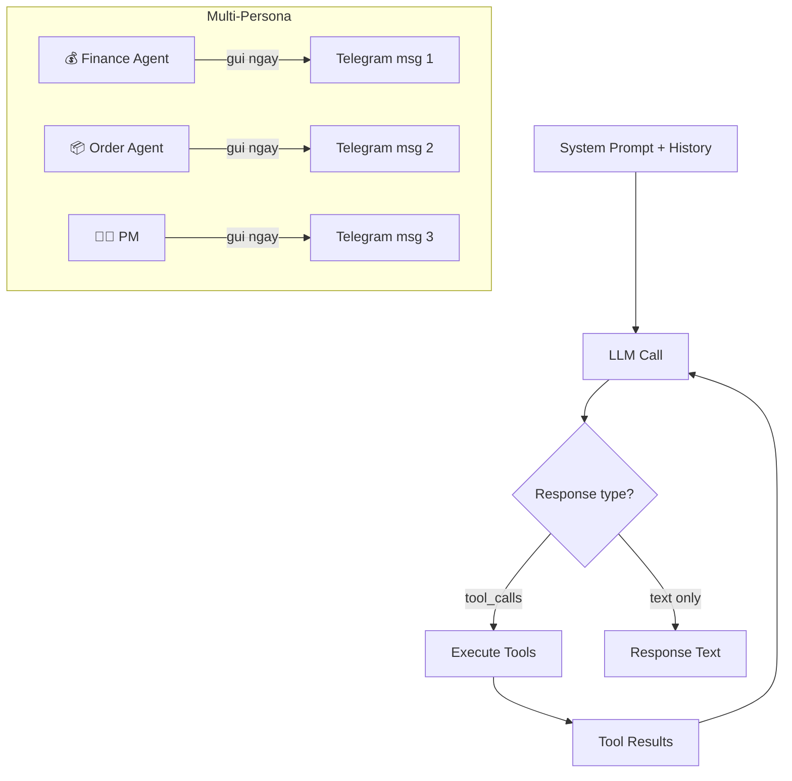
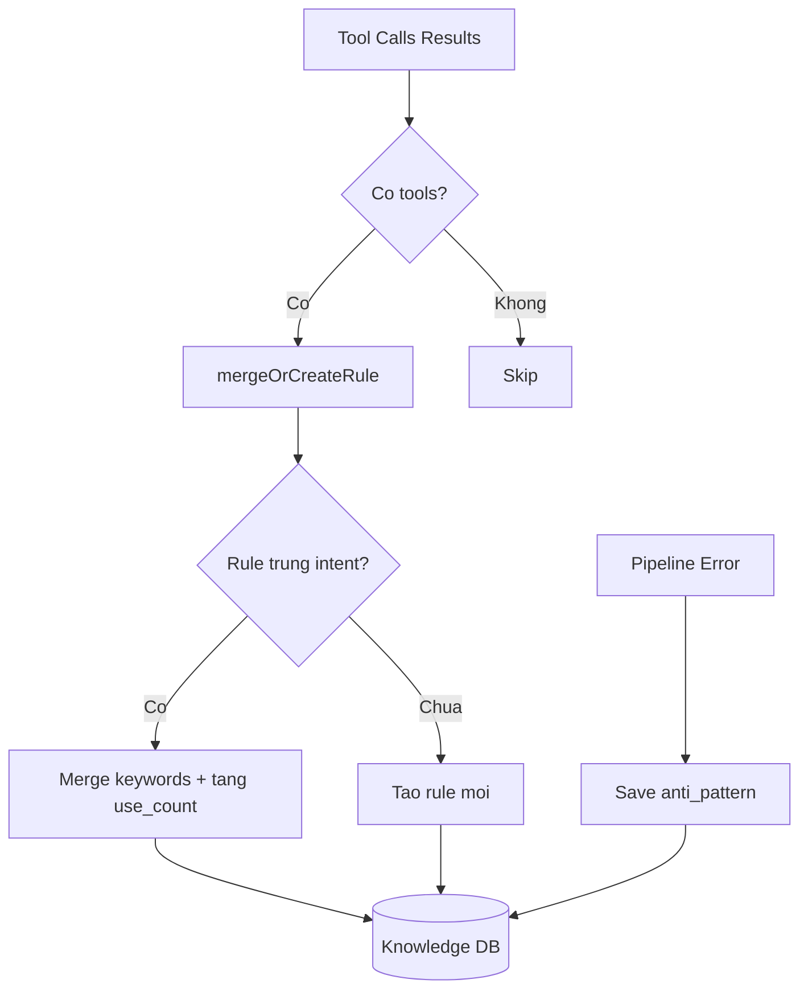
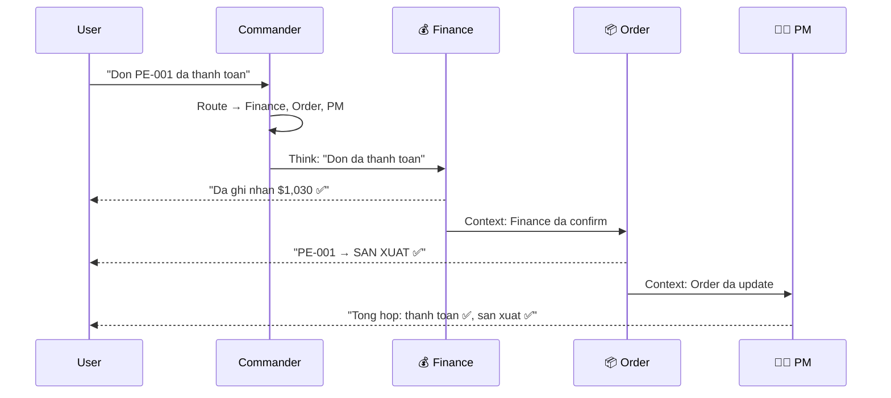

# Pipeline Architecture

## So sanh voi cac framework

| Tieu chi | LangChain | CrewAI | OpenAI Assistants | OpenClaw |
|----------|-----------|--------|-------------------|----------|
| Pipeline | Chain-based | Task-based | Thread-based | **Middleware pipeline** |
| Tool discovery | Static | Static | Static schema | **DB-driven** |
| Multi-agent | RouterChain | Hierarchical/Seq | Single assistant | **Hierarchy + Persona** |
| Memory | Buffer/Summary | 3-tier | Thread auto | **Knowledge scorer + feedback** |
| Self-learning | Khong co | Training mode | Fine-tune | **Real-time merge/create** |
| Config | Code | Code/YAML | API | **100% DB** |

---

## Pipeline Flow



### Chi tiet tung middleware

#### 01-Feedback (Implicit Detection)



- Khong hoi user "ban hai long khong?"
- Goi fast-api ngam de detect sentiment
- Update knowledge score tu dong

#### 02-Knowledge (RAG-lite Retrieval)



- Keyword-based scoring (chua co vector embedding)
- Per-tenant isolation
- Rules co use_count — uu tien rules dung nhieu

#### 03-Context (Resource Assembly)



**Resource Cache** (TODO — chua implement):
```
Startup hoac khi data thay doi → build cache:
{
  resources: [
    {type: "form", name: "Form nhap don", metadata: {fields: 19}},
    {type: "collection", name: "Don hang", metadata: {rows: 15}},
    {type: "workflow", name: "Tao Don Hang"},
    {type: "file", name: "cam_nang_sale.docx"},
    ...bat ky cai gi user tao
  ]
}
→ Inject ~200 chars vao prompt
→ Rebuild khi: add_row, create_collection, create_form, upload...
```

#### 04-Route (Engine + Agent Selection)



#### 05-Execute (LLM + Tool Loop)



- Tool loop: LLM goi tool → execute → tra ket qua → LLM tiep tuc
- Max 10 loops (tranh infinite)
- Multi-persona: moi agent gui message ngay khi xong

#### 06-Learn (Self-Learning)



- Intent = sorted tool names (vd: "add_row,list_rows")
- Cung intent → merge keywords, tang use_count
- Error → luu anti_pattern de tranh lap lai
- Per-tenant isolation

---

## Multi-Agent Conversation



- Moi persona gui message ngay khi xong (streaming)
- Persona sau doc response cua persona truoc
- Commander khong xu ly — chi route

---

## Gaps can fix (Priority order)

### 1. Generic Resource Cache (High)
```
Hien tai: context khong biet forms/templates ton tai
Can: startup build cache tu DB, inject vao prompt
Pattern: Observer — khi data thay doi → rebuild cache
```

### 2. Tool Registry Dynamic Dispatch (High)
```
Hien tai: switch/case 30+ tools
Can: Map<string, ToolHandler> — register at startup
Them tool moi = register function, khong sua switch
```

### 3. Vector Embedding cho Knowledge (Medium)
```
Hien tai: keyword matching (score thap, match sai)
Can: embedding model (OpenAI/local) + cosine similarity
Se tang chat luong retrieval dang ke
```

### 4. Context Window Management (Medium)
```
Hien tai: khong dem tokens, co the vuot context window
Can: token counter + priority truncation
  knowledge > form > files > old history
```

### 5. Event-driven Agent Communication (Medium)
```
Hien tai: agents chi trao doi khi user nhan
Can: data thay doi → event → trigger agents tu dong
  update_row("orders", status="PAID") → trigger Production Agent
```
